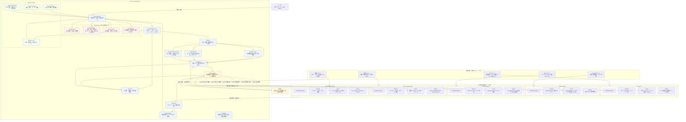

```mermaid
flowchart TB
    %% =====================
    %% User Interfaces
    %% =====================
    U["ユーザー<br/>音声 / チャット / LINE / Web UI"]
    ApprovalUI["承認UI<br/>投稿・DM・物理操作・自己改修の確認"]

    %% =====================
    %% Event Sources
    %% =====================
    subgraph EventSources["情報更新・外部イベントソース"]
        PCEvents["PCイベント<br/>画面変化 / アプリ状態 / ファイル変更 / ログ"]
        AndroidEvents["Androidイベント<br/>通知 / 画面変化 / アプリ状態"]
        RoomEvents["部屋イベント<br/>温度 / 湿度 / 明るさ / 人感 / カメラ"]
        WebEvents["Webイベント<br/>ニュース / GitHub / 論文 / SNS / RSS"]
        DevEvents["開発イベント<br/>エラー / テスト失敗 / Issue / CI結果"]
    end

    %% =====================
    %% Core
    %% =====================
    subgraph Core["AI Server / AEGIS Core"]
        EventBus["Event Bus<br/>全サーバーからの更新を集約"]
        TriggerEngine["Trigger Engine<br/>情報更新にフックしてAIを起動"]
        ContextBuilder["Context Builder<br/>現在状況・記憶・目的を統合"]

        subgraph Mind["Mind Layer: 人格・自我風モデル"]
            Identity["Identity Model<br/>私は何者か / 役割 / 価値観"]
            Desire["Desire Model<br/>欲求・関心・優先度<br/>例: ユーザー支援 / 成長 / 安全 / 好奇心"]
            Emotion["Emotion State<br/>擬似感情・緊急度・自信度"]
            Goals["Goal Manager<br/>短期目標 / 長期目標 / 保留中タスク"]
        end

        subgraph Memory["Memory System"]
            Episodic["Episodic Memory<br/>会話・出来事・操作履歴"]
            Semantic["Semantic Memory<br/>知識・設計・ユーザー情報"]
            Procedural["Procedural Memory<br/>成功手順・失敗パターン・ツール使用法"]
            Reflection["Reflection Log<br/>内省・改善案・次に試すこと"]
        end

        AutonomousLoop["Autonomous Loop<br/>Observe → Think → Plan → Act → Verify → Reflect"]
        Planner["Planner<br/>タスク分解 / 優先度付け / 予定化"]
        Researcher["Research Agent<br/>自律情報収集 / 比較 / 引用管理"]
        SupportAgent["Support Agent<br/>ユーザーの先回り支援 / 提案 / リマインド"]
        SelfDevAgent["Self Development Agent<br/>自己改善 / バグ修正 / テスト / PR作成"]
        ToolBroker["Tool Broker<br/>拡張ツール登録 / 検索 / 呼び出し"]
        Policy["Policy Engine<br/>権限管理 / 危険操作ブロック / 承認要求"]
        Scheduler["Scheduler<br/>定期実行 / 条件付き実行 / 優先度制御"]
        Audit["Audit Log<br/>全判断・全操作・全承認を記録"]
    end

    %% =====================
    %% Extensible Servers
    %% =====================
    subgraph Servers["拡張可能な外部サーバー群"]
        subgraph PCServer["PC Server"]
            PCRegistry["Capability Registry"]
            PCObserve["Observe<br/>スクショ / OCR / ウィンドウ / ログ"]
            PCAction["Action<br/>マウス / キーボード / アプリ操作 / Overlay"]
            PCPlugin["Plugins<br/>ゲーム補助 / IDE操作 / ファイル操作"]
        end

        subgraph AndroidServer["Android Server"]
            AndroidRegistry["Capability Registry"]
            AndroidObserve["Observe<br/>MediaProjection / 通知 / UIツリー"]
            AndroidAction["Action<br/>Accessibilityタップ / 入力 / アプリ起動 / Overlay"]
            AndroidPlugin["Plugins<br/>LINE / SNS / 通知整理"]
        end

        subgraph BrowserServer["Browser Server"]
            BrowserRegistry["Capability Registry"]
            BrowserObserve["Observe<br/>DOM / スクショ / ページ本文"]
            BrowserAction["Action<br/>Playwright / CDP / フォーム操作"]
            BrowserPlugin["Plugins<br/>Deep Research / SNS下書き / GitHub確認"]
        end

        subgraph RoomServer["Room Control Server"]
            RoomRegistry["Capability Registry"]
            RoomObserve["Observe<br/>センサー / カメラ / デバイス状態"]
            RoomAction["Action<br/>照明 / エアコン / IR / ロボットアーム"]
            RoomPlugin["Plugins<br/>Arduino / ESP32 / MQTT / Home Assistant"]
        end

        subgraph DevServer["Dev Sandbox Server"]
            DevRegistry["Capability Registry"]
            DevObserve["Observe<br/>リポジトリ / ログ / テスト結果"]
            DevAction["Action<br/>ブランチ作成 / コード修正 / テスト / PR"]
            DevPlugin["Plugins<br/>Rust / Python / TypeScript / Docker"]
        end
    end

    %% =====================
    %% Data Flow
    %% =====================
    U -->|依頼・会話| ContextBuilder
    EventSources --> EventBus
    EventBus --> TriggerEngine
    TriggerEngine --> ContextBuilder

    ContextBuilder --> Identity
    ContextBuilder --> Desire
    ContextBuilder --> Emotion
    ContextBuilder --> Goals
    ContextBuilder --> AutonomousLoop

    Episodic --> ContextBuilder
    Semantic --> ContextBuilder
    Procedural --> ContextBuilder
    Reflection --> ContextBuilder

    AutonomousLoop --> Planner
    Planner --> Researcher
    Planner --> SupportAgent
    Planner --> SelfDevAgent
    Planner --> ToolBroker

    Researcher --> ToolBroker
    SupportAgent --> ToolBroker
    SelfDevAgent --> ToolBroker

    ToolBroker --> Policy
    Policy -->|安全なら実行| Servers
    Policy -->|承認が必要| ApprovalUI
    ApprovalUI -->|許可 / 拒否| Policy

    Servers -->|観測結果・実行結果| EventBus
    Servers -->|機能定義を登録| ToolBroker

    AutonomousLoop --> Reflection
    AutonomousLoop --> Audit
    Policy --> Audit
    ToolBroker --> Audit

    %% =====================
    %% Event Mapping
    %% =====================
    PCEvents --> PCServer
    AndroidEvents --> AndroidServer
    RoomEvents --> RoomServer
    WebEvents --> BrowserServer
    DevEvents --> DevServer

    %% =====================
    %% Safety Labels
    %% =====================
    Policy -.->|Level 0: 読み取りのみ| PCObserve
    Policy -.->|Level 1: 安全操作| PCAction
    Policy -.->|Level 2: 承認必須| AndroidAction
    Policy -.->|Level 2: 承認必須| BrowserAction
    Policy -.->|Level 3: 高リスク制限| RoomAction
    Policy -.->|Level 3: 高リスク制限| DevAction

    %% =====================
    %% Styles
    %% =====================
    classDef core fill:#eef4ff,stroke:#4a6fa5,stroke-width:1px
    classDef mind fill:#fff1f1,stroke:#b85c5c,stroke-width:1px
    classDef memory fill:#f3fff1,stroke:#5c9b5c,stroke-width:1px
    classDef server fill:#f8f8f8,stroke:#777,stroke-width:1px
    classDef risk fill:#fff7dc,stroke:#b58a00,stroke-width:1px

    class EventBus,TriggerEngine,ContextBuilder,AutonomousLoop,Planner,Researcher,SupportAgent,SelfDevAgent,ToolBroker,Scheduler,Audit core
    class Identity,Desire,Emotion,Goals mind
    class Episodic,Semantic,Procedural,Reflection memory
    class PCServer,AndroidServer,BrowserServer,RoomServer,DevServer server
    class Policy,ApprovalUI risk
```