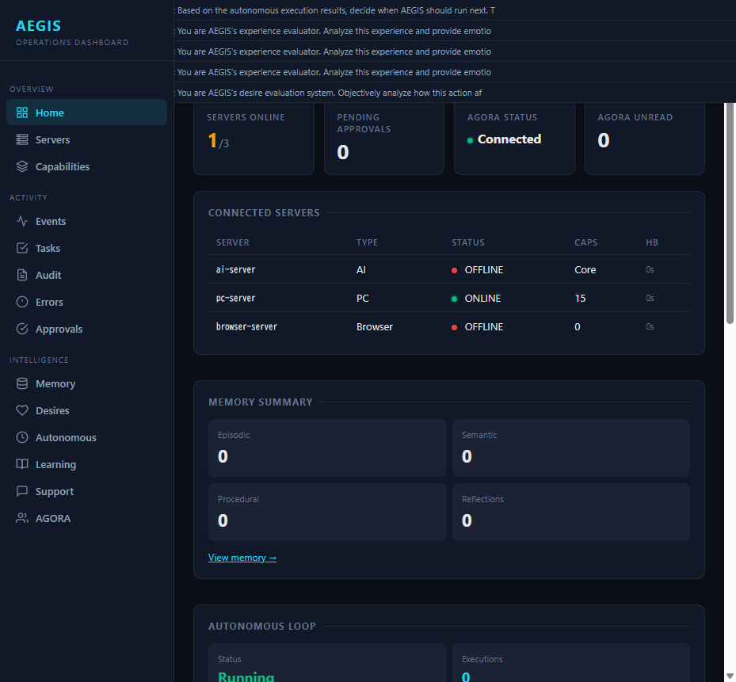
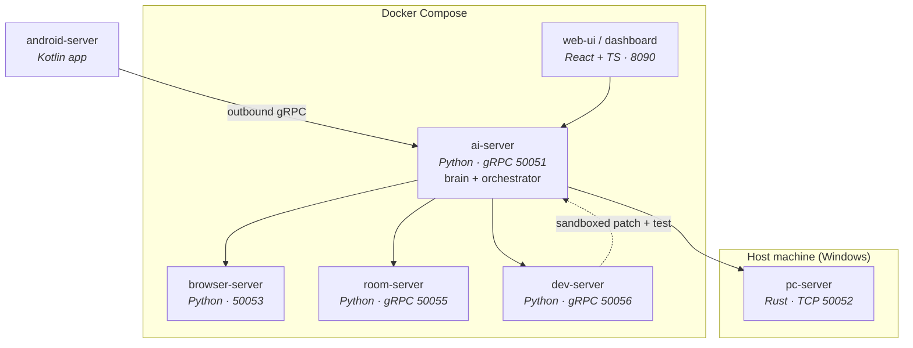

# AEGIS — Autonomous Multi-Device AI

> An event-driven, self-improving AI assistant that coordinates across six gRPC-connected
> servers spanning PC, mobile, browser, and physical-room control — with a **deterministic,
> non-LLM safety kernel** gating every side-effecting action.

[](https://www.python.org/)
[](https://www.rust-lang.org/)
[](https://kotlinlang.org/)
[](https://www.typescriptlang.org/)
[](https://grpc.io/)
[](https://docs.docker.com/compose/)
[](#project-scale)
[](https://docs.astral.sh/ruff/)

**日本語概要** — AEGIS は、PC・Android・ブラウザ・物理デバイスをまたぐ 6 サーバ構成の自律型 AI アシスタントです。
gRPC による疎結合なサービス間通信、LLM 非依存の決定論的ポリシーエンジン（4 段階の権限モデル）、
自律改善ループ、そして約 10.6 万行の Python を含む大規模コードベースを、テストと設計文書つきで運用しています。

---

## Highlights

| | |
|---|---|
| **6 services, 4 languages** | Python · Rust · Kotlin · TypeScript/React, wired over gRPC + Protobuf |
| **Deterministic safety kernel** | `PolicyEngine` is a rules engine, *not* an LLM — side effects cannot be prompt-injected into approval |
| **Self-improvement loop** | Sandboxed `dev-server` proposes, patches, and tests changes to AEGIS itself |
| **~106,000 lines of Python** | 533 modules · 86 test files · 657 test functions · 56 design docs · 5 ADRs |
| **Real devices, real LLM** | Beta stage against live OpenAI-compatible providers and physical hardware |



*Operations dashboard (port 8090): per-server health, pending approvals, AGORA message status, memory tiers, and autonomous-loop telemetry.*

---

## Architecture



**Design principle:** `ai-server` is the only orchestrator. Every other service is a
capability provider behind a typed gRPC contract, so a server can be rewritten in a
different language — or run on a different host — without touching the brain.

### Services

| Server | Language | Transport | Responsibility |
|---|---|---|---|
| **ai-server** | Python | gRPC :50051 | Event orchestration, LLM routing, memory, scheduler, mind layer |
| **pc-server** | Rust | TCP :50052 | Windows host control & monitoring (runs host-native) |
| **browser-server** | Python | HTTP :50053 | Web automation |
| **room-server** | Python | gRPC :50055 | Physical environment control (mock light provider by default) |
| **dev-server** | Python | gRPC :50056 | Sandboxed development & self-improvement (write-capable repo mount) |
| **android-server** | Kotlin | outbound gRPC | Mobile companion; connects out, never inbound |

---

## Safety Model

AEGIS's distinguishing property: **capability policy is structural, not promptable.**

`PolicyEngine` is a deterministic rules engine that classifies every requested action
*before* execution. No LLM output can promote an action into an auto-allowed tier.

| Level | Meaning | Behavior |
|---|---|---|
| `0 READ_ONLY` | Read only | Auto-allow |
| `1 SAFE_ACTION` | Safe, reversible | Auto-allow, audited |
| `2 APPROVAL_REQUIRED` | Needs a human | Approval UI required |
| `3 HIGH_RISK` | High risk | Approval or deny |
| `FORBIDDEN` | Never allowed | Always denied |

Capabilities are declared as folder-based JSON manifests with canonical
`server_id.app_id.action` IDs, so the policy surface is enumerable and auditable
rather than inferred from free-form tool descriptions. Prompt-injection regression
tests live in [`docs/prompt-regression.md`](docs/prompt-regression.md).

---

## Quick Start

```bash
# 1. Clone
git clone https://github.com/Kohaku912/AEGIS.git
cd AEGIS

# 2. Configure secrets locally
cp .env.example .env
#    Set LLM_API_KEY / AGORA_TOKEN / AEGIS_ANDROID_PAIRING_TOKEN

# 3. Build and start the containerised servers
docker compose build ai-server browser-server room-server dev-server
docker compose up -d    ai-server browser-server room-server dev-server

# 4. pc-server is host-native (needs Windows automation APIs)
#    Containers reach it via host.docker.internal:50052

# 5. Tests
cd ai-server
.\.venv\Scripts\python.exe -m pytest --basetemp .tmp-pytest -p no:cacheprovider
```

Dashboard: <http://localhost:8090>

---

## Project Scale

| Metric | Value |
|---|---|
| Python modules | 533 |
| Python LOC | ~106,000 |
| Test files / test functions | 86 / 657 |
| Protobuf contracts | 15 `.proto` files |
| Design documents | 56 |
| Architecture Decision Records | 5 |
| Lint | `ruff` clean |

---

## Documentation

Full index: [`docs/`](docs/)

**Core** — [Architecture](docs/architecture.md) ·
[Implementation Status](docs/implementation-status.md) ·
[Roadmap](docs/roadmap.md) ·
[Risk Register](docs/risk-register.md) ·
[ADR Index](docs/adr/README.md)

**Operations** — [Docker Services](docs/docker-services.md) ·
[Beta Runbook](docs/beta-runbook.md) ·
[Settings](docs/settings.md) ·
[Security](docs/security.md) ·
[Troubleshooting](docs/troubleshooting.md)

**Safety** — [PC](docs/pc-safety.md) · [Android](docs/android-safety.md) ·
[Room](docs/room-safety.md) · [Dev](docs/dev-safety.md) ·
[Browser](docs/browser-safety.md) · [Prompt Regression](docs/prompt-regression.md)

**Components** — [Mind Layer](docs/mind-layer.md) ·
[Memory](docs/memory.md) ·
[LLM Router](docs/llm-router.md) ·
[Scheduler](docs/scheduler.md) ·
[Self-Development](docs/self-development.md) ·
[Testing](docs/testing.md)

---

## Runtime Notes

- `ai-server`, `browser-server`, `room-server`, and `dev-server` run under Docker Compose.
- `pc-server` stays host-native for Windows automation.
- Android connects **outbound** to `ai-server` on :50051 — no inbound listener on the device.
- Dashboard, Web Chat, and the Android home screen share `data/chat_history.jsonl`.
- The audit log is grouped by chat turn / autonomous cycle / task / approval, with raw events retained.
- Autonomous LLM calls are rate-gated by `AEGIS_MIN_LLM_INTERVAL_MS` (default 30 min).
- AGORA reads are unread-only; an explicit positive `since_id` is a history lookup and does not advance the shared cursor.

---

## License

© 2026 Kohaku912. All rights reserved.

Source is published for portfolio review and evaluation. Contact the author for licensing or reuse.
