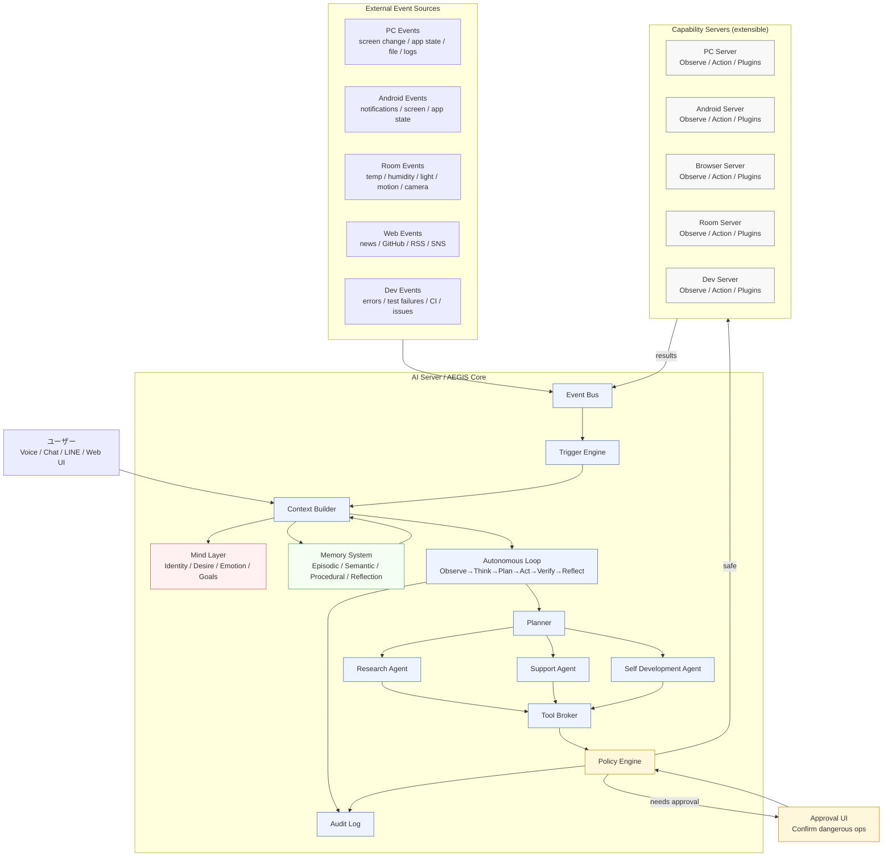
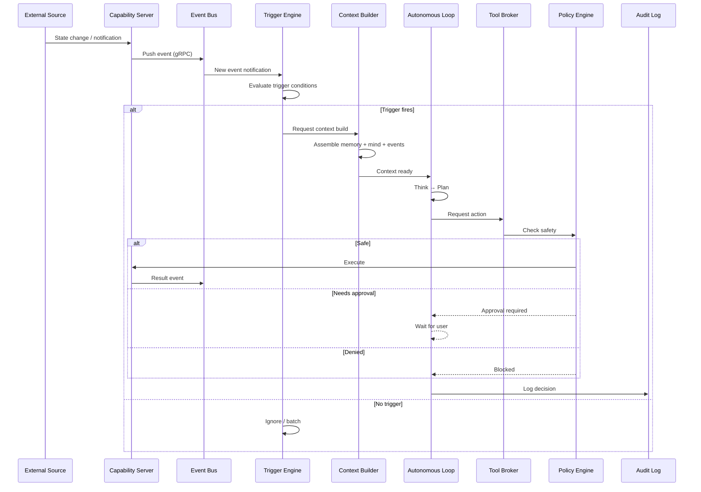
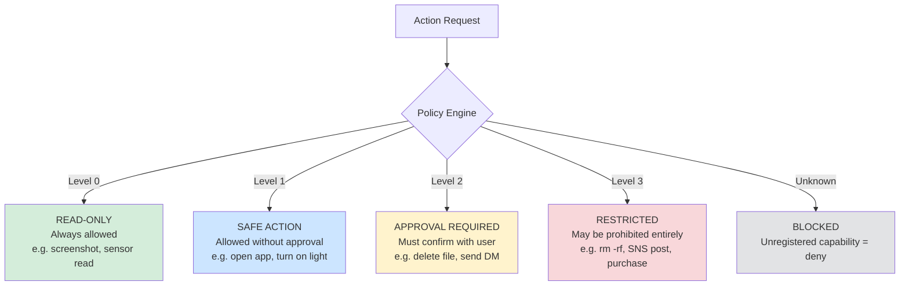
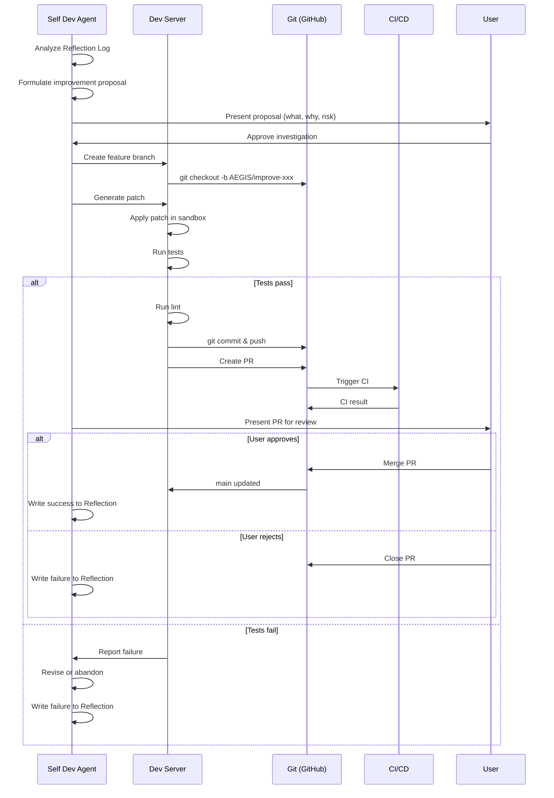

# AEGIS Architecture — AEGIS: Autonomous Multi-Device AI

> **Status**: Implemented (2026-06-13)  
> **Target audience**: AI coding agents, contributors, and future AEGIS itself  
> **Related**: [`AGENTS.md`](../AGENTS.md) — rules and conventions for agents working on this repo

---

## 1. Project Purpose

AEGIS is an **autonomous, event-driven, self-improving AI assistant** that spans multiple devices. It is not a single chatbot — It is a distributed system that:

- **Observes** events across PC, Android, browser, room sensors, and dev tools
- **Thinks** via a central AI Server with memory, goals, and identity
- **Acts** through capability servers — with graduated safety gates
- **Learns** from outcomes and improves its own codebase (self-development)
- **Desires** driven by intrinsic motivations (D2A-inspired)

**Key design constraint**: AEGIS must never act dangerously without explicit user approval. Safety is structural (not prompt-based). See [§7 Security Design](#7-security-design).

---

## 2. Overall Architecture

### 2.1 System Diagram



### 2.2 Design Principles

| Principle | Meaning |
|-----------|---------|
| **Contract-first** | All server APIs defined in `.proto` files before implementation |
| **Event-driven** | No polling loops — AEGIS reacts to events, schedules, and user requests |
| **Graduated safety** | 4 safety levels — read, safe write, approval-required, prohibited |
| **Self-improving** | Dev Server enables AEGIS to fix and extend its own code in sandboxed workflows |
| **Extensible** | Servers register capabilities dynamically via Tool Broker; new servers can be added |
| **Offline-first** | All core logic runs locally; cloud LLM is optional/cacheable |
| **Technology Decision Gate** | AI agents MUST NOT make major technology choices autonomously. See `AGENTS.md` §Technology Decision Gate. When multiple viable options exist for the same feature, present a structured comparison and ask the user. |
| **Technology Decision Gate** | AI agents MUST NOT make major technology choices autonomously. See `AGENTS.md` §Technology Decision Gate. When multiple viable options exist for the same feature, present a structured comparison and ask the user. |

### 2.3 Communication

All inter-server communication uses **gRPC** with Protocol Buffers (proto3). The `protos/AEGIS/` directory is the **single source of truth** for all API contracts. No server may communicate via ad-hoc REST or raw sockets without a proto definition.

---

## 3. Server Responsibilities

### 3.1 AI Server (AEGIS Core)

| Attribute | Value |
|-----------|-------|
| **Language** | Python 3.12+ |
| **Role** | Central brain |
| **Key modules** | Event Bus, Trigger Engine, Autonomous Loop, Planner, Agents, Tool Broker, Policy Engine, Memory, Mind, Audit |

**Must do**:
- Aggregate events from all servers via Event Bus
- Decide when to wake up (Trigger Engine)
- Build context from memory + current events + user state
- Plan and execute actions via the Autonomous Loop
- Enforce safety policy before every action
- Log every decision to Audit Log
- Expose gRPC API for all servers

**Must NOT**:
- Execute unapproved dangerous operations
- Bypass its own Policy Engine

### 3.2 PC Server

| Attribute | Value |
|-----------|-------|
| **Language** | 未確認 (Python or Node.js) |
| **Role** | PC control |

**Capabilities**:
- **Observe**: Screenshot, OCR, window title, active app, file system watch, log tail, clipboard
- **Action**: Mouse/keyboard input, app launch/close, window management, overlay display, file read/write
- **Plugins**: IDE integration, game assistance, file management

**Safety**: File deletion and sensitive directory access require approval (Level 2).

### 3.3 Android Server

| Attribute | Value |
|-----------|-------|
| **Language** | Kotlin |
| **Role** | Mobile device integration |

**Capabilities**:
- **Observe**: MediaProjection (screen), notification stream, UI tree, app state
- **Action**: Accessibility tap/swipe, text input, app launch, overlay
- **Plugins**: LINE, SNS monitoring, notification triage

**Safety**: SMS/DM sending, contact access require explicit approval (Level 2).

### 3.4 Browser Server

| Attribute | Value |
|-----------|-------|
| **Language** | Python 3.12+ + browser-use |
| **Role** | Web automation |

**Capabilities**:
- **Observe**: DOM snapshot, screenshot, page text extraction, network log
- **Action**: Navigation, click, form fill, file download
- **Plugins**: Deep research (multi-page synthesis), SNS draft, GitHub monitoring

**Safety**: SNS posting, message sending, purchases are approval-required (Level 2/3).

### 3.5 Room Server

| Attribute | Value |
|-----------|-------|
| **Language** | 未確認 |
| **Role** | Physical environment control |

**Capabilities**:
- **Observe**: Temperature, humidity, brightness, motion, camera, device status
- **Action**: Light control, AC, IR blaster, smart plug
- **Plugins**: Arduino/ESP32, MQTT bridge, Home Assistant integration

**Safety**: Physical device operation requires approval (Level 2/3 depending on risk).

### 3.6 Dev Server

| Attribute | Value |
|-----------|-------|
| **Language** | 未確認 |
| **Role** | Sandboxed self-development |

**Capabilities**:
- **Observe**: Repository state, test results, lint output, CI status
- **Action**: Branch creation, code modification, test execution, PR creation
- **Plugins**: Python, Rust, TypeScript, Docker sandbox

**Safety**: All code changes must go through the self-dev workflow (see §8). No direct production access. No access to secrets.

---

## 4. Capability Model

Each server exposes capabilities to the AI Server via a **Capability Registry**. This is not a static list — servers register their capabilities at startup and can be extended with plugins.

### Capability Structure (proto definition — planned)

```protobuf
message Capability {
  string id = 1;              // unique identifier, e.g. "pc.screenshot"
  string server_id = 2;       // which server provides this
  string name = 3;            // human-readable
  string description = 4;     // what it does
  SafetyLevel min_safety = 5; // minimum safety level required
  repeated Parameter params = 6;
  repeated string tags = 7;   // for search/discovery
}

enum SafetyLevel {
  LEVEL_0_READ = 0;           // read-only, always safe
  LEVEL_1_SAFE_ACT = 1;       // safe action (e.g. open app, turn on light)
  LEVEL_2_APPROVAL = 2;       // requires user approval (e.g. send DM, delete file)
  LEVEL_3_RESTRICTED = 3;     // high-risk, may be prohibited entirely
}
```

### How capabilities are used

1. Each server registers capabilities with the Tool Broker at startup
2. The Planner/Agents query the Tool Broker for available capabilities
3. The Policy Engine checks the `min_safety` level before execution
4. Unknown or unregistered capabilities are blocked by default

---

## 5. AI Server Internal Modules

### 5.1 Module Map

```
ai-server/src/
├── event_bus.py          # Ingests events from all servers
├── trigger_engine.py     # Decides when to wake the Autonomous Loop
├── context_builder.py    # Assembles context for LLM/decision
├── autonomous_loop.py    # Main observe→think→plan→act→verify→reflect loop
├── planner.py            # Task decomposition, prioritization
├── agents/
│   ├── research.py       # Deep information gathering
│   ├── support.py        # Proactive user assistance
│   └── self_dev.py       # Self-improvement workflows
├── tool_broker.py        # Capability registry & dispatch
├── policy_engine.py      # Safety enforcement
├── memory/
│   ├── episodic.py       # Conversation & event history
│   ├── semantic.py       # Knowledge & user facts
│   ├── procedural.py     # Learned procedures
│   └── reflection.py     # Self-analysis & improvement notes
├── mind/
│   ├── identity.py       # Who AEGIS is
│   ├── desire.py         # Goals, curiosity, priorities
│   ├── emotion.py        # Urgency, confidence state
│   └── goals.py          # Short/long-term goal tracking
├── scheduler.py          # Cron-like scheduled tasks
└── audit.py              # Immutable decision log
```

### 5.2 Context Builder

**Purpose**: Before any decision, assemble a structured context from:
- Current events (from Event Bus)
- Relevant memories (from Memory System)
- Current Mind state (identity, goals, emotional state)
- Available capabilities (from Tool Broker)
- User preferences and recent interactions

**Output**: A `Context` object passed to the Autonomous Loop (and ultimately to the LLM).

### 5.3 Autonomous Loop

The core decision loop. Every cycle follows this sequence:

```
Observe → Think → Plan → Act → Verify → Reflect
```

| Phase | What happens |
|-------|-------------|
| **Observe** | Gather events, build context |
| **Think** | LLM evaluates situation against goals, identity, and constraints |
| **Plan** | Planner decomposes intent into actionable steps |
| **Act** | Dispatch actions via Tool Broker → Policy Engine → Capability Server |
| **Verify** | Check action results against expected outcome |
| **Reflect** | Write to Reflection Log: what worked, what failed, what to try next |

### 5.4 Planner

Decomposes high-level goals into executable steps:
- Task dependency resolution
- Priority ordering (urgency × importance × safety)
- Scheduling (now / later / conditional)
- Fallback planning (if step fails, try alternative)

### 5.5 Research Agent

Autonomous deep-dive information gathering:
- Multi-source search (web, internal knowledge, memory)
- Cross-reference and fact-check
- Citation tracking
- Summary generation

Uses Browser Server capabilities for web access.

### 5.6 Support Agent

Proactive user assistance:
- Anticipate needs based on schedule, habits, context
- Suggest actions before user asks
- Remind of deadlines and pending tasks
- Detect anomalies (unusual patterns, missed events)

### 5.7 Self Development Agent

Manages AEGIS's own improvement (see §8 for full workflow):
- Analyzes Reflection Log for improvement opportunities
- Formulates code change proposals
- Delegates to Dev Server for implementation
- Reviews results and closes the feedback loop

### 5.8 Tool Broker

Central capability registry and dispatch:
- Servers register capabilities at startup
- Agents query for available tools
- Routes action requests to appropriate server
- Tracks capability health and latency

### 5.9 Policy Engine

**CRITICAL MODULE** — enforces safety before every action.

Checks every action request against:
1. Capability safety level (0–3)
2. User-configured permissions
3. Current approval state
4. Action-specific rules (e.g., "never delete *.pem files")

Output: `ALLOW`, `ASK_APPROVAL`, or `DENY`.

### 5.10 Memory System

| Memory Type | Stores | Retention |
|-------------|--------|-----------|
| **Episodic** | Conversations, events, action history | Configurable (default: 90 days) |
| **Semantic** | Facts, knowledge, user info, design docs | Permanent (versioned) |
| **Procedural** | Successful procedures, failure patterns, tool usage tips | Permanent (reinforced by success) |
| **Reflection** | Self-analysis, improvement ideas, things to try next | Permanent (linked to episodes) |

Memory is stored locally (未確認: specific database — likely SQLite for small data + vector DB for embeddings).

### 5.11 Mind Layer

A structured model of AEGIS's "personality" — NOT sentient, but a persistent state that guides decision-making:

| Component | Purpose |
|-----------|---------|
| **Identity** | What AEGIS is: assistant, researcher, developer, companion |
| **Desire** | Priorities: help user > learn > stay safe > be curious |
| **Emotion** | State indicators: urgency level, confidence, fatigue proxy |
| **Goals** | Active short-term and long-term goals with progress tracking |

The Mind Layer is **not** a source of autonomous action — it biases the Planner and LLM, but all actions still go through the Policy Engine.

---

## 6. Event-Driven Architecture

### 6.1 Event Flow



### 6.2 Trigger Types

| Trigger | Source | Example |
|---------|--------|---------|
| **PC screen change** | PC Server | Active window changed → AEGIS checks if help needed |
| **Android notification** | Android Server | SMS received → AEGIS reads and summarizes |
| **Room sensor update** | Room Server | Motion detected at unusual time → AEGIS alerts user |
| **Web/RSS/GitHub update** | Browser Server | New GitHub issue on AEGIS repo → AEGIS investigates |
| **Test failure / log error** | Dev Server | CI failed → AEGIS diagnoses and proposes fix |
| **Scheduled** | Scheduler (internal) | Every morning → AEGIS prepares daily briefing |
| **User request** | UI / chat | Direct command → AEGIS executes immediately |
| **Reflection trigger** | Autonomous Loop | After N actions → AEGIS reviews and writes reflection |

### 6.3 Event Bus Design

- **Push-based**: Servers push events to AI Server via gRPC streaming
- **In-memory queue**: Events buffered in asyncio queue (未確認: may need Redis for persistence)
- **Deduplication**: Events have unique IDs; duplicate events within a window are merged
- **Priority**: Events tagged with priority (urgent / normal / background)
- **Batching**: Low-priority events may be batched to reduce LLM wake-ups

### 6.4 Trigger Engine Logic

The Trigger Engine decides whether an event (or batch of events) justifies waking the Autonomous Loop. Rules:

1. **Always wake**: User request, test failure, security-relevant event
2. **Wake if above threshold**: Multiple related events, anomaly detected, goal-relevant event
3. **Defer**: Low-priority events, routine sensor readings (batch and process periodically)
4. **Ignore**: Known noise, duplicate events, events from paused servers

Trigger rules are configurable and will themselves be improvable by the Self Development Agent (with approval).

---

## 7. Security Design

### 7.1 Safety Levels



### 7.2 Safety Level Definitions

| Level | Name | Scope | Examples | Default |
|-------|------|-------|----------|---------|
| **0** | Read-only | Observe, no side effects | Screenshot, OCR, DOM read, sensor read, log tail | ALLOW |
| **1** | Safe action | Non-destructive, reversible | Open app, move window, turn on light, navigate browser, overlay display | ALLOW |
| **2** | Approval required | Potentially harmful or private | Delete file, send DM, post SNS, access contacts, install package, email send | ASK |
| **3** | Restricted | High-risk or irreversible | Bulk delete, purchase, SSH key access, production deploy, system config change | ASK or DENY |
| — | Unregistered | Unknown capability | Any capability not in the registry | DENY |

### 7.3 Structural Safety (not prompt-based)

The Policy Engine is **not** an LLM prompt. It is:
- A **deterministic rules engine** that checks capability safety level, user permissions, and action-specific rules
- Implemented as a Python module with no LLM dependency for the safety decision
- **Fail-closed**: if the Policy Engine is unreachable, all actions are denied
- **Audited**: every decision (allow/deny/ask) is logged

### 7.4 Approval UI

When an action requires approval (Level 2/3), the Approval UI:
1. Presents: what action, which server, what parameters, why it was requested
2. Offers: Allow once / Allow for session / Deny / Deny and remember
3. Times out: if no response within configurable window → deny
4. Logs: all approval decisions to Audit Log

The Approval UI is a separate component (not part of the Policy Engine) to ensure clean separation of concerns.

### 7.5 Data Protection

- User data stays on local network by default
- External API calls (LLM, web search) must be explicitly configured
- Secrets via Docker secrets / environment variables — **never** in source code or proto files
- `.gitignore` covers `.env`, `secrets/`, `*.pem`, `credentials.json`
- Proto files must never contain default values that are sensitive (e.g. API keys)

---

## 8. Self-Development Workflow

AEGIS can improve its own codebase — but only through a strictly gated workflow.

### 8.1 Workflow Diagram



### 8.2 Workflow Steps (gated)

| Step | Who | Gate |
|------|-----|------|
| **1. Analyze** | Self Dev Agent | Read-only (safe) |
| **2. Propose** | Self Dev Agent | User must approve investigation |
| **3. Branch** | Dev Server | Create branch in sandbox |
| **4. Patch** | Dev Server | Generate and apply code changes |
| **5. Test** | Dev Server | Run full test suite in sandbox |
| **6. Lint** | Dev Server | Run linter/formatter |
| **7. Push + PR** | Dev Server | Push branch, create Pull Request |
| **8. CI** | CI/CD | Automated CI runs on PR |
| **9. Review** | User | User reviews diff, tests, CI status |
| **10. Merge** | User | Only user can merge to main |
| **11. Rollback** | User | If merge causes issues, user can revert |

### 8.3 Self-Development Constraints

- **No direct push to main** — all changes go through PR
- **No merge without CI passing** — CI must be green
- **No merge without user approval** — user is the only merge authority
- **No access to secrets** — Dev Server sandbox has no access to `.env`, SSH keys, or production credentials
- **Scope limited** — Self Dev Agent can only modify files within the AEGIS repo; cannot install system packages or modify Docker daemon
- **All attempts logged** — successful and failed self-dev attempts are in Audit Log

### 8.4 Rollback

If a self-developed change causes issues:
1. User reverts the merge via GitHub (standard `git revert`)
2. Self Dev Agent logs the failure to Reflection
3. Future proposals for similar changes are deprioritized

---

## 9. MVP Implementation Order

### Phase 1: Foundation (current → milestone)

| # | Task | Server(s) | Deliverable |
|---|------|-----------|-------------|
| 1.1 | Complete proto definitions for all servers | `protos/` | All `.proto` files |
| 1.2 | Set up Docker Compose skeleton | Root | `docker-compose.yml` with all 6 servers (placeholder containers) |
| 1.3 | AI Server: project scaffold | `ai-server/` | `pyproject.toml`, `pytest`, `ruff`, gRPC server stub |
| 1.4 | AI Server: Event Bus + Trigger Engine | `ai-server/` | Events can be pushed and trigger evaluation |
| 1.5 | AI Server: Policy Engine | `ai-server/` | Safety level enforcement (Level 0–3) |
| 1.6 | AI Server: Audit Log | `ai-server/` | Immutable decision log (append-only file or SQLite) |

### Phase 2: First Capability Server

| # | Task | Server(s) | Deliverable |
|---|------|-----------|-------------|
| 2.1 | Browser Server: scaffold | `browser-server/` | `package.json`, Playwright, gRPC client |
| 2.2 | Browser Server: Observe capabilities | `browser-server/` | Screenshot, DOM read, page text extraction |
| 2.3 | Browser Server: Action capabilities | `browser-server/` | Navigation, click, form fill (Level 1) |
| 2.4 | Tool Broker: Capability Registry | `ai-server/` | Dynamic registration and query of capabilities |
| 2.5 | AI Server: Context Builder + Memory (basic) | `ai-server/` | Context assembly with episodic memory |

### Phase 3: Autonomous Loop

| # | Task | Server(s) | Deliverable |
|---|------|-----------|-------------|
| 3.1 | AI Server: Autonomous Loop (basic) | `ai-server/` | Observe → Think → Plan → Act cycle |
| 3.2 | AI Server: Planner | `ai-server/` | Task decomposition |
| 3.3 | AI Server: Research Agent | `ai-server/` | Multi-source research via Browser Server |
| 3.4 | AI Server: Approval UI | `ai-server/` | User-facing approval for Level 2/3 actions |
| 3.5 | Integration test: "Research a topic" | All active | E2E: user asks question → AEGIS researches → returns summary |

### Phase 4: Additional Servers

| # | Task | Server(s) | Deliverable |
|---|------|-----------|-------------|
| 4.1 | PC Server: scaffold + Observe | `pc-server/` | Screenshot, window detection |
| 4.2 | Android Server: scaffold + notifications | `android-server/` | Notification sync |
| 4.3 | Room Server: scaffold + sensor read | `room-server/` | Temperature/humidity/motion (MQTT bridge) |
| 4.4 | Support Agent | `ai-server/` | Proactive suggestions based on context |

### Phase 5: Self-Improvement

| # | Task | Server(s) | Deliverable |
|---|------|-----------|-------------|
| 5.1 | Dev Server: scaffold + sandbox | `dev-server/` | Isolated Docker container for code ops |
| 5.2 | Dev Server: branch/patch/test/PR | `dev-server/` | Full self-dev workflow |
| 5.3 | Self Dev Agent | `ai-server/` | Analyze Reflection → propose → delegate |
| 5.4 | Reflection memory | `ai-server/` | Structured self-analysis after actions |
| 5.5 | Self-dev E2E | All active | AEGIS proposes and creates a real PR (with user merge) |

### Phase 6: Mind + Advanced Memory

| # | Task | Server(s) | Deliverable |
|---|------|-----------|-------------|
| 6.1 | Mind Layer (identity, goals) | `ai-server/` | Persistent personality model |
| 6.2 | Procedural memory | `ai-server/` | Learned procedures from successful actions |
| 6.3 | Semantic memory (RAG) | `ai-server/` | Vector-based knowledge retrieval |
| 6.4 | Emotion/urgency model | `ai-server/` | Confidence and urgency state tracking |

---

## 10. Out of Scope (Not Implementing Now)

These are explicitly deferred to avoid scope creep. They may be reconsidered in future ADRs.

| Item | Reason for deferral |
|------|---------------------|
| **Cloud deployment / SaaS** | AEGIS runs locally first |
| **Multi-user support** | Single user (owner) for MVP; multi-user adds significant security complexity |
| **Voice I/O** | Text-first MVP; voice is a UX layer on top |
| **Real-time video processing** | Camera still frames only for MVP |
| **Financial transactions** | Too high-risk for initial phases |
| **Third-party app store / plugin marketplace** | Capabilities are manually configured initially |
| **Federation (multiple AEGIS instances collaborating)** | Single-instance first |
| **Mobile app for Room Server control** | Web UI first |
| **End-to-end encryption of all inter-server traffic** | Local network trust for MVP; TLS added later |
| **LLM fine-tuning / custom model training** | Use off-the-shelf LLM APIs first |
| **Gamification / avatar / visual character** | Function over form for MVP |

---

## 11. Existing vs Planned — Gap Analysis

### What exists now (2026-06-11)

| File | Content | Status |
|------|---------|--------|
| `AGENTS.md` | Agent guidance | ✅ Created |
| `README.md` | Project overview | ✅ Created |
| `.gitignore` | Language/secret exclusions | ✅ Created |
| `protos/AEGIS/common.proto` | `Status` message only | ✅ Skeleton |
| `protos/AEGIS/ai_server.proto` | Empty service definition | ⚠️ Placeholder |
| `Mermaid.md` | Architecture diagram (Mermaid) | ✅ Reference |
| Directory structure | All 6 servers + docs/ + protos/ | ✅ Skeleton |

### What is missing (needs creation per Phase 1)

| File | Phase |
|------|-------|
| `protos/AEGIS/pc_server.proto` | 1.1 |
| `protos/AEGIS/android_server.proto` | 1.1 |
| `protos/AEGIS/room_server.proto` | 1.1 |
| `protos/AEGIS/browser_server.proto` | 1.1 |
| `protos/AEGIS/dev_server.proto` | 1.1 |
| `docker-compose.yml` | 1.2 |
| `ai-server/pyproject.toml` | 1.3 |
| `ai-server/src/*` (all modules in §5) | 1.3–1.6 |
| `browser-server/package.json` | 2.1 |

### No contradictions with existing code

There is no existing implementation code — only skeleton files. The architecture described here is the **first** detailed design, so there are no migration issues or conflicts. All existing skeleton files (`common.proto`, `ai_server.proto`) are consistent with this design.

---

## Appendix A: Key Terminology

| Term | Definition |
|------|------------|
| **AEGIS** | The AI assistant — the persona that users interact with |
| **AEGIS** | The codebase / platform name |
| **Capability** | A specific function a server can perform (observe or act) |
| **Tool Broker** | Registry of all available capabilities |
| **Autonomous Loop** | The observe→think→plan→act→verify→reflect cycle |
| **Policy Engine** | Deterministic safety rules engine (not LLM) |
| **Mind Layer** | Structured personality model (not sentient AI) |
| **Self Development** | AEGIS improving its own codebase via Dev Server |

## Appendix B: Related Documents

| Document | Purpose |
|----------|---------|
| [`AGENTS.md`](../AGENTS.md) | Rules for AI coding agents working on this repo |
| [`README.md`](../README.md) | Human-readable project overview |
| [`Mermaid.md`](../Mermaid.md) | Standalone architecture diagram (Mermaid source) |
| [`protos/AEGIS/`](../protos/AEGIS/) | gRPC API definitions (single source of truth) |
| `docs/adr/` | Architecture Decision Records (to be created) |
