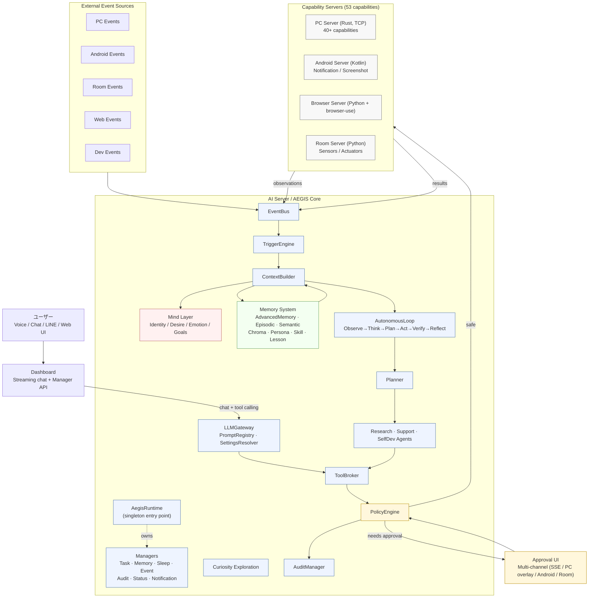
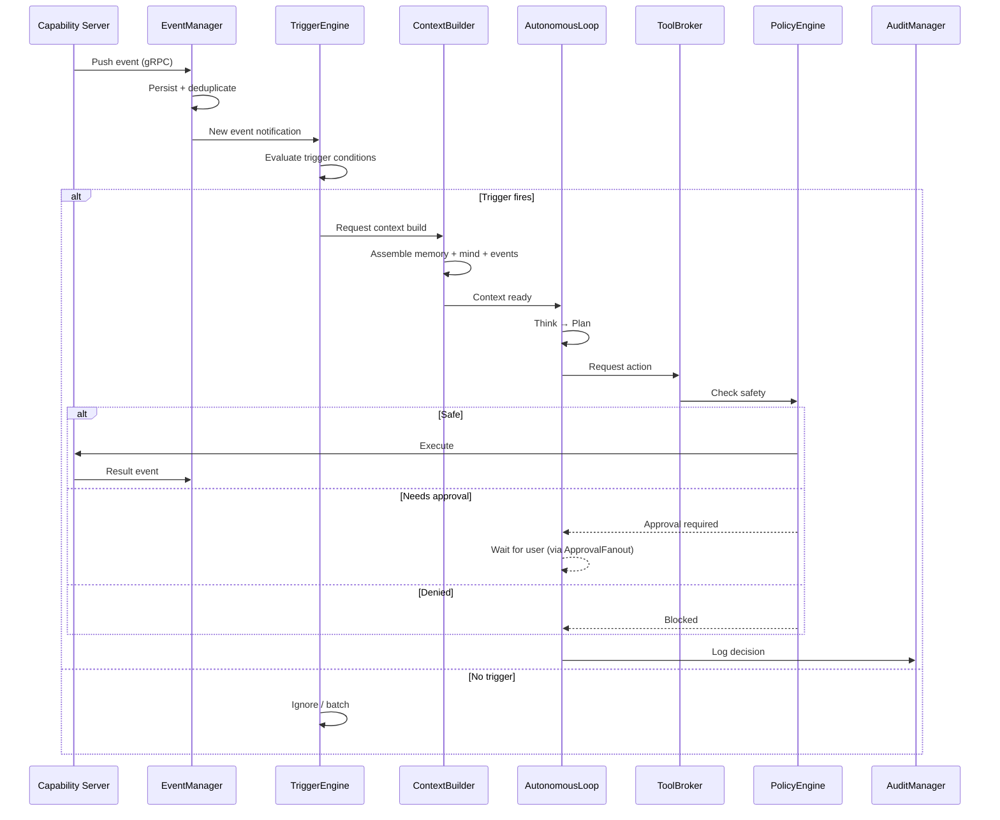
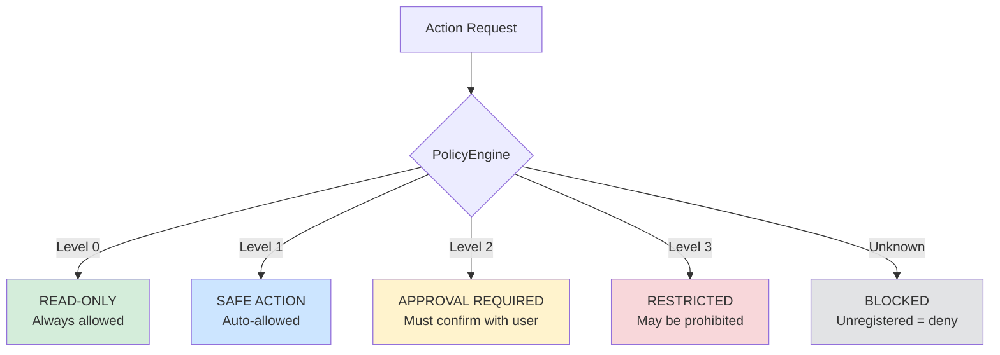

# AEGIS Architecture — Autonomous Multi-Device AI

> **Status**: Implemented (verified against current code snapshot)  
> **Tests**: 157 passed, 0 failed  
> **Capabilities**: 53 registered  
> **Target audience**: AI coding agents, contributors, and future AEGIS itself  
> **Related**: [`AGENTS.md`](../AGENTS.md) — rules and conventions for agents working on this repo

---

## 1. Project Purpose

AEGIS is an **autonomous, event-driven, self-improving AI assistant** that spans multiple devices. It is not a single chatbot — it is a distributed system that:

- **Observes** events across PC, Android, browser, room sensors, and dev tools
- **Thinks** via a central AI Server with memory, goals, identity, and desires
- **Acts** through registered capabilities — with graduated safety gates
- **Learns** from outcomes via a learning pipeline (ActionTrace → Lesson → Workflow → Skill)
- **Desires** driven by 10 intrinsic motivations (D2A-inspired)

**Key design constraint**: AEGIS must never act dangerously without explicit user approval. Safety is structural (PolicyEngine), not prompt-based. See [§7 Security Design](#7-security-design).

---

## 2. Overall Architecture

### 2.1 System Diagram



### 2.2 Design Principles

| Principle | Meaning |
|-----------|---------|
| **Runtime singleton** | `AegisRuntime` is the sole entry point. All state mutations go through Managers. |
| **Contract-first** | All server APIs defined in `.proto` files before implementation |
| **Event-driven** | No polling loops — AEGIS reacts to events, schedules, and user requests |
| **Graduated safety** | 4 safety levels — read, safe write, approval-required, prohibited |
| **Self-improving** | Desire-driven autonomous loop with learning pipeline |
| **Extensible** | Folder-based JSON capability manifests; new servers can be added |
| **Offline-first** | All core logic runs locally; cloud LLM is optional/cacheable |
| **LLM-driven** | The LLM interprets all user messages. No keyword matching or regex routing. |
| **Technology Decision Gate** | AI agents MUST NOT make major technology choices autonomously. |

### 2.3 Communication

All inter-server communication uses **gRPC** with Protocol Buffers (proto3). The `protos/aegis/` directory is the **single source of truth** for the shared service contracts. PC Server uses TCP JSON protocol on port 50052. Browser Server uses HTTP on port 50053. Android is a client companion app that connects outbound to the core AI Server on 50051.

### 2.4 Runtime Singleton & Manager Architecture

`AegisRuntime` (`ai-server/src/aegis_ai/runtime.py`) is the process-wide singleton and the **sole entry point** for all external code. It owns and wires all managers at startup:

| Manager | File | Purpose |
|---------|------|---------|
| **TaskManager** | `task/task_manager.py` | 9-state task lifecycle: pending → running → waiting_approval → ... → completed/failed |
| **MemoryManager** | `memory/memory_manager.py` | Unified memory entry point. `get_backend("advanced")` etc. |
| **SleepManager** | `memory/sleep.py` | Memory consolidation during idle periods |
| **EventManager** | `event/event_manager.py` | Event persistence, cursor queries, dead letter queue |
| **AuditManager** | `audit/audit_manager.py` | JSONL tail reader (64KB chunks), cursor pagination. No `read_all()` in main path. |
| **StatusManager** | `status/status_manager.py` | Background health checks (TCP port connectivity), cached snapshots |
| **NotificationManager** | `notification/notification_manager.py` | Non-approval notification management |

**Architecture Invariants**:

| Rule | Description |
|------|-------------|
| **Runtime singleton** | `AegisRuntime` is the sole entry point. External code MUST NOT create services directly. |
| **Manager pattern** | All state mutations go through Managers. Managers are owned by AegisRuntime. |
| **MemoryManager** | All memory backends accessed through `runtime.memory_manager.get_backend()`. |
| **EventManager** | All event publishing through `runtime.event_manager.publish()`. |
| **StatusManager** | Server status via `runtime.status_manager.get_snapshot()`. No `_check_port()` in routes. |
| **TaskManager** | AutonomousLoop creates/finishes tasks via TaskManager. |
| **AuditManager** | JSONL tail reader only. No `read_all()` in main path. |

---

## 3. Server Responsibilities

### 3.1 AI Server (AEGIS Core)

| Attribute | Value |
|-----------|-------|
| **Language** | Python 3.14 |
| **Port** | 50051 (gRPC), 8090 (Dashboard) |
| **Role** | Central brain — LLM, memory, desires, policy, autonomous execution |
| **Key modules** | AegisRuntime, 7 Managers, EventBus, TriggerEngine, AutonomousLoop, LLMGateway, ToolBroker, PolicyEngine, CapabilityCatalog |

**Must do**:
- Aggregate events from all servers via EventBus
- Decide when to wake up (TriggerEngine)
- Build context from memory + current events + user state
- Plan and execute actions via the AutonomousLoop
- Enforce safety policy before every action (PolicyEngine)
- Log every decision to AuditLog (AuditManager)
- Route LLM requests via LLMGateway → LLMRouter → Providers

**Must NOT**:
- Execute unapproved dangerous operations
- Bypass its own PolicyEngine
- Create memory backends or services directly (use Managers)
- Use keyword matching for user message interpretation

### 3.2 PC Server

| Attribute | Value |
|-----------|-------|
| **Language** | Rust |
| **Port** | 50052 (TCP JSON) |
| **OS** | Windows 専用 |
| **Role** | PC observation and control |

**Capabilities (40+)**:
- **Observe**: Screenshot, active window, window list, clipboard, OS info, screen size
- **Action**: Mouse click/move, keyboard type, hotkey, app launch, window management
- **Overlay**: Custom click-through overlays (WS_EX_TOPMOST + WS_EX_LAYERED + WS_EX_TRANSPARENT)
- **Shell**: PowerShell / CMD execution via TCP command
- **File**: Read/write with allowlist/denylist path safety

**Safety**: File deletion, shell commands, password entry are DENIED (Level 3). Mouse click, keyboard, file write require approval (Level 2).

### 3.3 Android Server

| Attribute | Value |
|-----------|-------|
| **Language** | Kotlin |
| **Port** | 50054 contract / outbound client |
| **Role** | Mobile companion app |

**Capabilities**:
- **Observe**: MediaProjection (screen), notification stream, UI tree, app state
- **Action**: Accessibility tap/swipe, text input, app launch, overlay
- **Safety**: SMS/DM sending, contact access require explicit approval (Level 2)

### 3.4 Browser Server

| Attribute | Value |
|-----------|-------|
| **Language** | Python + browser-use |
| **Port** | 50053 (HTTP) |
| **Role** | Web automation via natural language |

**Capabilities**:
- **Browse**: LLM-driven browser automation via browser-use library
- **Safety**: SNS posting, message sending, purchases are approval-required (Level 2/3)

**Notable**: DeepSeek compatibility patch applied. Verification detection for user confirmation.

### 3.5 Room Server

| Attribute | Value |
|-----------|-------|
| **Language** | Python |
| **Port** | 50055 (gRPC) |
| **Role** | Physical environment control |

**Capabilities**:
- **Observe**: Temperature, humidity, brightness, motion, camera, device status
- **Action**: Light control, AC (16-32°C validated), IR blaster (allowlist), smart plug
- **Safety**: Emergency stop is Level 1 (auto-allowed). Physical device operation requires approval.

### 3.6 Dashboard

| Attribute | Value |
|-----------|-------|
| **Language** | Python (Flask) |
| **Port** | 8090 |
| **Role** | Web UI — chat, monitoring, settings |

**Features**:
- Streaming chat with **tool calling** (CapabilityCatalog-driven, max 5 rounds)
- **ask_user** support (tool pause → user input → continue)
- Manager API routes (tasks, events, audit, status, notifications, memory, sleep)
- Settings Web UI with persistence to `config/settings.json`
- Approval UI with multi-channel fanout

---

## 4. Capability Model

Capabilities are defined as **JSON manifests** in a folder structure. This is the **single source of truth** — no hardcoded capability definitions in Python code.

### 4.1 Folder Structure

```
capabilities/
├── builtin/
│   ├── pc-server/
│   │   ├── screenshot/
│   │   │   └── get_screenshot.json
│   │   └── system/
│   │       └── get_os_info.json
│   ├── browser-server/
│   ├── android-server/
│   └── room-server/
└── generated/
    └── ...
```

### 4.2 Canonical ID Format

**Format**: `server_id.app_id.action`

| Example Capability ID | Server |
|----------------------|--------|
| `pc-server.screenshot.get_screenshot` | PC Server |
| `browser-server.page.open_page` | Browser Server |
| `android-server.notification.get_notifications` | Android Server |
| `room-server.environment.get_environment` | Room Server |

Old ID formats (e.g. `pc.screenshot.get_screenshot`) are resolved via aliases in `CapabilityCatalog`.

### 4.3 Capability Lifecycle

1. `FolderCapabilityRegistry` loads JSON manifests from `capabilities/` at startup
2. `CapabilityCatalog` converts manifests to `Capability` objects (canonical IDs)
3. `ToolRegistry` registers all capabilities in memory
4. `CapabilityIndex` provides lightweight catalog + Chroma vector search
5. `ToolBroker` uses `CapabilityCatalog.resolve()` + `jsonschema.validate()` before execution
6. `LLMTaskInterpreter` uses `CapabilityCatalog.list_for_llm()` for capability listing

### 4.4 Safety Level Definitions

| Level | Name | Examples | Default |
|-------|------|----------|---------|
| **0** | Read-only | Screenshot, OCR, sensor read, log tail | ALLOW |
| **1** | Safe action | Open app, move window, turn on light, overlay display | ALLOW |
| **2** | Approval required | Delete file, send DM, post SNS, mouse click, keyboard type | ASK |
| **3** | Restricted | Bulk delete, purchase, SSH key access, shell commands | ASK or DENY |
| — | Unregistered | Any capability not in the registry | DENY |

---

## 5. AI Server Internal Modules

### 5.1 Module Map

```
ai-server/src/
├── aegis_ai/
│   ├── runtime.py                    # Process-wide singleton, builds all managers
│   ├── event_bus.py                  # In-memory event queue + subscription
│   ├── trigger_engine.py             # Event → trigger evaluation
│   ├── context_builder.py            # Assembles context for LLM
│   ├── policy_engine.py              # Deterministic safety enforcement
│   ├── tool_broker.py                # Capability invocation with validation
│   ├── tool_registry.py              # In-memory capability registry
│   ├── capability_catalog.py         # Unified catalog, alias resolution
│   ├── capability_index.py           # Chroma vector search + keyword search
│   ├── folder_registry.py            # JSON manifest loader
│   ├── audit.py                      # AuditLog (legacy)
│   ├── scheduler.py                  # Cron-like scheduled tasks
│   ├── approval.py                   # ApprovalStore (legacy)
│   ├── task/
│   │   └── task_manager.py           # 9-state task lifecycle
│   ├── event/
│   │   └── event_manager.py          # Persistence, cursor queries, dead letter
│   ├── audit/
│   │   └── audit_manager.py          # JSONL tail reader (64KB chunks)
│   ├── status/
│   │   └── status_manager.py         # Background health checks, cached snapshots
│   ├── notification/
│   │   └── notification_manager.py   # Non-approval notifications
│   ├── approval/
│   │   ├── approval_manager.py       # Unified approval lifecycle
│   │   ├── fanout.py                 # Multi-channel delivery (4 channels)
│   │   └── channels/                 # dashboard_sse, pc_overlay, android, room
│   ├── memory/
│   │   ├── memory_manager.py         # Unified entry: get_backend("advanced")
│   │   ├── sleep.py                  # SleepManager for consolidation
│   │   ├── advanced.py               # Zep-inspired: entity/fact/temporal
│   │   ├── episodic.py               # Conversation & event history
│   │   ├── semantic.py               # Knowledge & facts
│   │   ├── chroma_semantic.py        # ChromaDB vector search
│   │   ├── persona.py                # Person tracking
│   │   ├── action_trace.py           # Autonomous action recording
│   │   ├── lesson_memory.py          # Extracted lessons
│   │   ├── workflow_memory.py        # Repeated successful patterns
│   │   ├── skill_memory.py           # Reusable procedures
│   │   └── consolidation.py          # MemoryConsolidator
│   ├── autonomous/
│   │   ├── autonomous_loop.py        # Desire-driven execution + TaskManager
│   │   ├── planner.py                # LLM-based task decomposition
│   │   └── curiosity_exploration.py  # Novelty-seeking exploration
│   ├── agents/
│   │   ├── research.py               # Deep information gathering
│   │   ├── support.py                # Proactive user assistance
│   │   └── self_dev.py               # Self-improvement workflows
│   ├── desire/
│   │   ├── desire_system.py          # 3 desires, pressure tracking
│   │   └── fulfillment.py            # Per-desire condition→delta rules
│   ├── llm/
│   │   ├── gateway.py                # LLMGateway facade (runtime-owned)
│   │   ├── router.py                 # Task → provider routing
│   │   ├── factory.py                # DeepSeek/OpenAI/Mock provider factory
│   │   ├── prompt_registry.py        # YAML prompts (config/prompts.yaml)
│   │   ├── settings_resolver.py      # YAML profiles (config/llm.yaml)
│   │   ├── cost_tracker.py           # Token/cost tracking
│   │   ├── memory_context.py         # Memory context for LLM prompts
│   │   └── providers/                # openai_provider, mock
│   ├── mind/
│   │   ├── identity.py               # AEGIS identity
│   │   ├── desire.py                 # Mind-level desire state
│   │   ├── emotion.py                # Emotion appraisal
│   │   └── goals.py                  # Goal tracking
│   ├── web/
│   │   ├── app.py                    # Flask DashboardApp
│   │   ├── dashboard_routes.py       # Pages + streaming chat
│   │   ├── manager_routes.py         # Manager API routes
│   │   ├── chat_tools.py             # call_llm_with_tools() + regex parsing
│   │   ├── settings_routes.py        # Settings CRUD API
│   │   └── settings_ui_routes.py     # Settings Web UI
│   ├── security/                     # Auth, CSRF, rate limit, TLS
│   ├── observation/                  # Multi-server observation aggregation
│   └── ...                           # (additional modules)
├── config/
│   ├── prompts.yaml                  # Prompt source of truth
│   └── llm.yaml                      # LLM profile source of truth
└── tests/                            # 157 tests total
```

### 5.2 Context Builder

**Purpose**: Before any decision, assemble structured context from:
- Current events (from EventBus)
- Relevant memories (from Memory System via MemoryManager)
- Current Mind state (identity, goals, emotional state, desire values)
- Available capabilities (from CapabilityCatalog)
- User preferences and recent interactions

**Output**: A context string passed to the LLM via LLMGateway.

### 5.3 Autonomous Loop

**File**: `ai-server/src/aegis_ai/autonomous/autonomous_loop.py`

The core desire-driven execution loop:

```
Desire monitoring → Spontaneous observation → Curiosity exploration
  → Task generation → ActionTrace recording → Skill/Workflow search
  → Execution → TaskManager update → Desire evaluation → Self-scheduling
```

| Feature | Description |
|---------|-------------|
| Desire monitoring | Checks desire states every tick; triggers when gap ≥ 2.0 |
| Task generation | LLM generates tasks for low desires |
| TaskManager integration | Creates task before execution, completes/fails after |
| Skill/Workflow reuse | Searches SkillMemory before executing from scratch |
| Action tracing | Full trace via ActionTraceMemory |
| Self-scheduling | LLM decides next interval (300–7200s), fallback 1 hour |
| Spontaneous observation | Every 5 minutes via ObservationService |
| Curiosity exploration | When curiosity desire ≥ 6.0 |

**Constructor**: `llm_provider, desire_system, memory_system, reflection_engine, tool_broker, action_trace, skill_memory, workflow_memory, lesson_memory, observation_system, curiosity_system, policy_engine, task_manager (optional)`

### 5.4 Planner

**File**: `ai-server/src/aegis_ai/autonomous/planner.py`

LLM-based task decomposition:
- Breaks goals into Subtasks with `capability_ids` and dependencies
- "Don't do" decisions for unsafe or impossible goals
- Dependency resolution and ordering
- Post-execution verification
- Failure replanning (up to 3 replans)

### 5.5 Agents

| Agent | Purpose |
|-------|---------|
| **Research Agent** | Deep-dive information gathering via Browser Server |
| **Support Agent** | Proactive user assistance (does NOT bypass PolicyEngine) |
| **Self Development Agent** | Analyzes Reflection → proposes improvements → delegates to Dev Server |

### 5.6 Tool Broker

Central capability dispatch with validation gate:

1. `CapabilityCatalog.resolve(capability_id)` — canonical ID resolution
2. `jsonschema.validate(arguments, manifest.input_schema)` — argument validation
3. `ServerExecutor.execute()` — manifest-driven routing to server clients
4. `PolicyEngine.check()` — safety enforcement

Non-existent capability IDs → NOT_FOUND. Invalid arguments → DENY.

### 5.7 Policy Engine

**CRITICAL MODULE** — deterministic safety rules engine (not LLM-based).

Checks every action request against:
1. Capability safety level (0–3)
2. User-configured permissions (SettingsPermissionGuard)
3. Current approval state (ApprovalStore)
4. Action-specific rules (e.g., "never delete *.pem files")

Output: `ALLOW`, `ASK_APPROVAL`, or `DENY`. **Fail-closed**: if unreachable, all actions denied.

### 5.8 LLM Gateway & Prompt Management

| Component | File | Description |
|-----------|------|-------------|
| **LLMGateway** | `llm/gateway.py` | Facade over LLMRouter. Runtime-owned. Backward-compatible methods + optional `profile` kwarg. |
| **LLMRouter** | `llm/router.py` | Task routing based on task_type, privacy, cost budget |
| **PromptRegistry** | `llm/prompt_registry.py` | YAML-backed (`config/prompts.yaml`). Hot-reload (mtime-gated), fail-closed validation. |
| **LLMSettingsResolver** | `llm/settings_resolver.py` | YAML-backed (`config/llm.yaml`). Profile resolution with bounds validation. |
| **Text-based tool calling** | `web/chat_tools.py` | DeepSeek compatibility: regex parsing of `<tool_call>` instead of OpenAI `tools` parameter. |

### 5.9 Memory System

| Memory Type | File | Purpose |
|-------------|------|---------|
| **AdvancedMemory** | `memory/advanced.py` | Zep-inspired: entity tracking, fact extraction, temporal awareness |
| **EpisodicMemory** | `memory/episodic.py` | Conversation & event history (JSONL) |
| **SemanticMemory** | `memory/semantic.py` | Knowledge & user facts |
| **ChromaSemanticMemory** | `memory/chroma_semantic.py` | ChromaDB vector search (fallback to keyword on failure) |
| **PersonaMemory** | `memory/persona.py` | Person tracking with conversations |
| **ActionTraceMemory** | `memory/action_trace.py` | Autonomous action recording (max 500 traces) |
| **LessonMemory** | `memory/lesson_memory.py` | Extracted lessons from traces |
| **WorkflowMemory** | `memory/workflow_memory.py` | Repeated successful patterns |
| **SkillMemory** | `memory/skill_memory.py` | Reusable procedures (highest-level learning) |
| **SleepConsolidation** | `memory/sleep_consolidation.py` | Experience → knowledge promotion |

**Learning pipeline**: `ActionTrace → Lesson → Workflow → Skill`

All backends accessed through `MemoryManager.get_backend("name")`. Available: `advanced`, `episodic`, `semantic`, `skill`, `lesson`, `workflow`, `experiential`, `person`, `store`.

### 5.10 Mind Layer

| Component | Purpose |
|-----------|---------|
| **Identity** | What AEGIS is: assistant, researcher, developer, companion |
| **Desire** | 10 intrinsic motivations (0-10 scale), frustration tracking |
| **Emotion** | Urgency level, confidence, fatigue proxy |
| **Goals** | Active short-term and long-term goals with progress tracking |
| **SocialIntelligence** | Relationship awareness, interaction style adaptation |

The Mind Layer biases the LLM but all actions still go through PolicyEngine.

### 5.11 Curiosity Exploration

**File**: `autonomous/curiosity_exploration.py`

When curiosity desire ≥ 6.0, AEGIS autonomously explores:
- **Sources**: Questions, failures, unknowns, improvements, LLM suggestions
- **Scoring**: importance×0.3 + novelty×0.25 + usefulness×0.2 + interest×0.2 − risk×0.1
- **Safety**: All exploration read-only. Side effects require PolicyEngine approval.

---

## 6. Event-Driven Architecture

### 6.1 Event Flow



### 6.2 Trigger Types

| Trigger | Source | Example |
|---------|--------|---------|
| **PC screen change** | PC Server | Active window changed → checks if help needed |
| **Android notification** | Android Server | SMS received → reads and summarizes |
| **Room sensor update** | Room Server | Motion at unusual time → alerts user |
| **Web/GitHub update** | Browser Server | New issue on repo → investigates |
| **Scheduled** | Scheduler | Every morning → daily briefing |
| **User request** | Dashboard chat | Direct command → executes immediately |
| **Desire-driven** | Autonomous Loop | Frustration ≥ 2.0 → generates and executes tasks |

### 6.3 Event Bus Design

- **Push-based**: Servers push events to AI Server via gRPC/TCP
- **EventManager**: Persistent event storage with cursor-based pagination and dead letter queue
- **Deduplication**: Events have unique IDs; duplicates within a window are merged
- **Priority**: Events tagged with priority (urgent / normal / background)

---

## 7. Security Design

### 7.1 Safety Levels



### 7.2 Structural Safety (not prompt-based)

The PolicyEngine is:
- A **deterministic rules engine** — no LLM dependency for safety decisions
- **Fail-closed**: if unreachable, all actions denied
- **Audited**: every decision logged via AuditManager

### 7.3 Approval System

When an action requires approval (Level 2/3):

```
PolicyEngine → ApprovalManager → ApprovalFanout
                                    ├── DashboardChannel (SSE)
                                    ├── PCOverlayChannel (click-through overlay)
                                    ├── AndroidChannel (notification)
                                    └── RoomChannel (display + TTS)
```

| Feature | Description |
|---------|-------------|
| Multi-channel | Approval pushed to all 4 channels simultaneously |
| Timeout | No response within window → auto-deny |
| Session approval | Allow once / Allow for session / Deny / Deny and remember |
| Audit | All decisions logged to AuditManager |

### 7.4 Data Protection

- User data stays on local network by default
- External API calls (LLM, web search) must be explicitly configured
- Secrets via environment variables — **never** in source code or proto files
- TLS available for gRPC (`security/tls_config.py`)

---

## 8. Self-Development Workflow

AEGIS can improve its own codebase — but only through a strictly gated workflow.

### 8.1 Workflow Steps

| Step | Who | Gate |
|------|-----|------|
| **1. Analyze** | SelfDevAgent | Read-only (safe) |
| **2. Propose** | SelfDevAgent | User must approve investigation |
| **3. Branch** | Dev Server | Create branch in sandbox |
| **4. Patch** | Dev Server | Generate and apply code changes |
| **5. Test** | Dev Server | Run full test suite |
| **6. Lint** | Dev Server | Run ruff (Python) / cargo clippy (Rust) |
| **7. Push + PR** | Dev Server | Push branch, create Pull Request |
| **8. Review** | User | User reviews diff, tests, CI status |
| **9. Merge** | User | **Only user can merge to main** |

### 8.2 Constraints

- **No direct push to main** — all changes go through PR
- **No merge without user approval** — user is the only merge authority
- **No access to secrets** — Dev Server sandbox has no access to `.env` or SSH keys
- **Scope limited** — only files within the AEGIS repo
- **All attempts logged** — via AuditManager

---

## 9. Implementation Status (2026-06-17)

### Systems

| System | Status | Notes |
|--------|--------|-------|
| **Runtime singleton** | ✅ Complete | AegisRuntime + 7 Managers |
| **Capability Management** | ✅ Complete | Folder-based JSON manifests, 53 capabilities |
| **Desire System** | ✅ Complete | Pressure-based 3 desires, fulfillment.py rules |
| **Autonomous Loop** | ✅ Complete | Desire-driven, TaskManager integration |
| **Dashboard** | ✅ Complete | Streaming chat + tool calling, Manager API routes |
| **PC Server** | ✅ Complete | Rust, TCP, 40+ capabilities, custom overlay |
| **Browser Server** | ✅ Complete | browser-use, DeepSeek compatibility patch |
| **LLM Integration** | ✅ Complete | LLMGateway + PromptRegistry + text-based tool calling |
| **Approval System** | ✅ Complete | ApprovalManager + Fanout + 4 channels |
| **Memory System** | ✅ Complete | AdvancedMemory + Chroma + learning pipeline |
| **E2E Testing** | ✅ Complete | 157 tests passing |

### Deferred Items

- EventManager server clients (replace `event_bus.publish()` in 5+ files)
- Approval encapsulation (encapsulate approval_store/queue inside ApprovalManager)
- 10k-entry audit performance test

---

## 10. Out of Scope

| Item | Reason |
|------|--------|
| **Cloud deployment / SaaS** | Local-first architecture |
| **Multi-user support** | Single user (owner) for MVP |
| **Real-time video processing** | Camera still frames only |
| **Financial transactions** | Too high-risk |
| **Federation** | Single-instance first |
| **LLM fine-tuning** | Use off-the-shelf LLM APIs |

---

## Appendix A: Key Terminology

| Term | Definition |
|------|------------|
| **AEGIS** | The AI assistant persona and the codebase/platform name |
| **AegisRuntime** | Process-wide singleton, sole entry point for all external code |
| **Capability** | A specific function a server can perform (JSON manifest in `capabilities/`) |
| **ToolBroker** | Capability invocation with PolicyEngine validation |
| **CapabilityCatalog** | Unified catalog — ID resolution, alias mapping, LLM listing |
| **AutonomousLoop** | Desire-driven observe→think→plan→act→verify→reflect cycle |
| **PolicyEngine** | Deterministic safety rules engine (not LLM) |
| **LLMGateway** | Facade over LLMRouter — runtime-owned, profile-based resolution |
| **Learning Pipeline** | ActionTrace → Lesson → Workflow → Skill |

## Appendix B: Server Ports

| Server | Port | Protocol |
|--------|------|----------|
| AI Server (gRPC) | 50051 | gRPC |
| AI Server (Dashboard) | 8090 | HTTP |
| PC Server | 50052 | TCP JSON |
| Browser Server | 50053 | HTTP |
| Android Server | 50054 contract / outbound client |
| Room Server | 50055 | gRPC |
| Dev Server | 50056 | gRPC |

## Appendix C: Related Documents

| Document | Purpose |
|----------|---------|
| [`AGENTS.md`](../AGENTS.md) | Rules for AI coding agents working on this repo |
| [`README.md`](../README.md) | Human-readable project overview |
| [`protos/aegis/`](../protos/aegis/) | gRPC API definitions (single source of truth) |
| [`docs/memory.md`](memory.md) | Memory system design and components |
| [`docs/desire-system.md`](desire-system.md) | Desire system design and fulfillment |
| [`docs/dashboard.md`](dashboard.md) | Dashboard features and API routes |
| [`docs/approval-ui.md`](approval-ui.md) | Approval system multi-channel design |
| [`docs/llm-router.md`](llm-router.md) | LLM routing, Gateway, PromptRegistry |
| [`docs/self-development.md`](self-development.md) | Self-development workflow |
| [`docs/testing.md`](testing.md) | Test categories and commands |
| [`docs/roadmap.md`](roadmap.md) | Project roadmap and milestones |

## Current Implementation Notes

- AI, Browser, Room, and Dev servers are Docker Compose services; PC Server remains host-native.
- Dashboard Audit Log stores raw entries but displays grouped operations by default.
- Audit grouping flows through `contextvars` and is persisted as `audit_group_id`, `audit_group_type`, and `audit_group_title`.
- Chat and Android mobile chat share the same chat history store and use the same tool execution path.
- Autonomous loop uses StatusManager state for capability availability and keeps a 30 minute minimum LLM interval by default.
- AGORA read-posts capability is strict unread mode for normal reads; explicit positive `since_id` is history mode.
